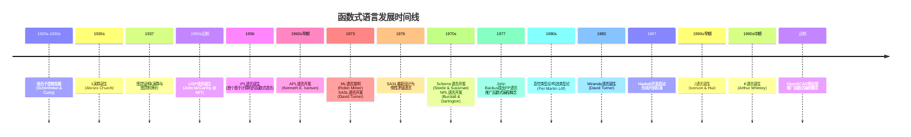

- [x] T000001.函数式语言（是声明式语言的一个子类）
- [x] T000002.指令式语言
	- [x] T000002.001 过程式语言
	- [x] T000002.002 面向对象语言
- [ ] T000003.声明式语言
	- [x] T000003.001 函数式语言
	- [ ] T000003.002 逻辑式编程
	- [ ] T000004.003 其他
- [x] T000004.数据竞争
- [ ] T000005.实现内存分配器
## T000001.函数式编程

定义：**函数式编程**，或称**函数程序设计**、**泛函编程**（英语：Functional programming），是一种[编程范型](https://zh.wikipedia.org/wiki/%E7%BC%96%E7%A8%8B%E8%8C%83%E5%9E%8B "编程范型")，它将[电脑运算](https://zh.wikipedia.org/wiki/%E9%9B%BB%E8%85%A6%E9%81%8B%E7%AE%97 "电脑运算")视为[函数](https://zh.wikipedia.org/wiki/%E5%87%BD%E6%95%B0 "函数")运算，并且**避免使用程序[状态](https://zh.wikipedia.org/w/index.php?title=%E7%8A%B6%E6%80%81_\(%E8%AE%A1%E7%AE%97%E6%9C%BA%E7%A7%91%E5%AD%A6\)&action=edit&redlink=1 "状态 (计算机科学)（页面不存在）")以及[可变对象](https://zh.wikipedia.org/wiki/%E4%B8%8D%E5%8F%AF%E8%AE%8A%E7%89%A9%E4%BB%B6 "不可变对象")。（[WIKI](https://zh.wikipedia.org/wiki/%E5%87%BD%E6%95%B0%E5%BC%8F%E7%BC%96%E7%A8%8B)**）

总结：借助函数组合与求值，声明所需的计算逻辑。

### 时间线


### 语言案例

#### LISP

#### Haskell

```haskell
binarySearch :: Ord a => a -> [a] -> Int
binarySearch _ [] = -1
binarySearch target arrs = search 0 (length arrs - 1)
    where 
        search left right
            | left > right = -1
            | otherwise =
                let 
                    mid = (left + right) `div` 2
                    midVal = arrs !! mid
                in case compare target midVal of
                    EQ -> mid
                    LT -> search left (mid - 1)
                    GT -> search (mid+1) right
```
#### Scala

## T000002.指令式语言

定义：**程序就是一系列给计算机下达的指令，这些指令会改变程序的状态（例如变量的值）。** 

总结：借助指令对状态进行修改以最终获取获取所需的状态。

### 主要特点

1. **状态改变**：这是最核心的特征。程序拥有状态（通常表现为变量），而语句（指令）的目的就是改变这些状态。
    - 例如：`x = x + 1;` 这个指令就明确地改变了变量 `x` 的状态。
2. **明确的控制流**：程序使用控制流语句（如 `if`、`else`、`for`、`while`）来指定指令的执行顺序。程序员必须精确地描述在什么条件下执行哪部分代码，以及循环多少次。
3. **关注“如何”做**：程序员需要深入思考解决问题的具体步骤和流程，并将这个过程翻译成代码。
### 语言案例

#### C

#### Fortran

#### Java

## 声明式语言

定义：它们建造计算机程序的结构和元素，表达[计算](https://zh.wikipedia.org/wiki/%E8%AE%A1%E7%AE%97 "计算")的逻辑而不用描述它的[控制流程](https://zh.wikipedia.org/wiki/%E6%8E%A7%E5%88%B6%E6%B5%81%E7%A8%8B "控制流程")[[1]](https://zh.wikipedia.org/wiki/%E5%AE%A3%E5%91%8A%E5%BC%8F%E7%B7%A8%E7%A8%8B#cite_note-1)。

### 语言案例

#### Haskell

#### ELm

#### Prolog

#### SQL

#### HTML

#### YAML

#### Json

## T000004 数据竞争

定义：
**数据竞争** 是一种在多线程编程中常见的、非常隐蔽且危险的错误。它发生在以下条件**同时满足**时：

1. **两个或更多线程**并发访问**同一块内存位置**。
2. **至少有一个访问是写操作**
3. **线程间没有使用明确的同步机制**来协调这些访问。

### 规避方法

#### 同步机制

##### 互斥锁

##### 信号量

#### 原子操作

##### 原子类型

1. C++: std::atomic

#### 避免状态共享

##### 线程局部存储

##### 不可变数据

##### 消息传递

1. GO： Channel

##### 只读共享

### 检测工具

1. ThreadSanitizer


