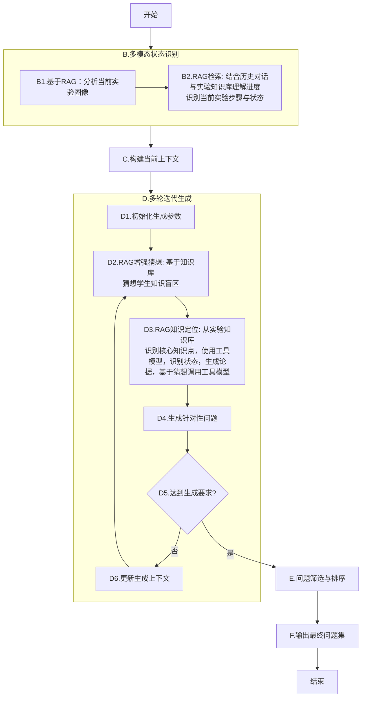

- [ ] 问题可回答
- [ ] 聚焦核心状态（核心步骤）
	- [ ] 核心状态的识别
	- [ ] 什么是核心状态
- [ ] 问题难度，通过创设情景，引发学生思考（基于状态将多个知识点串联，如何基于核心状态创建情境）




## 参数初始化

```python
generation_params = {
    # 数量控制
    "target_question_count": 3,           # 目标问题数量
    "max_iterations": 5,                  # 最大迭代次数
    "min_questions_per_topic": 1,         # 每个知识点最少问题数
    
    # 难度分布
    "difficulty_distribution": {
        "basic": 0.4,     # 基础理解题比例
        "application": 0.4, # 应用题比例  
        "challenge": 0.2    # 挑战题比例
    },
    
    # 问题类型分布
    "question_types": {
        "conceptual": 0.3,    # 概念理解类
        "operational": 0.4,   # 操作原理类
        "analytical": 0.3     # 数据分析类
    },
    
    # 质量控制
    "min_quality_score": 0.7, # 最低质量阈值
    "diversity_threshold": 0.8 # 多样性阈值
}
```

## 初始化上下文

```python
experiment_context = {
    # 实验基础信息
    "experiment_name": "验证牛顿第二定律",
    "current_step": "测量加速度阶段", 
    "step_state": "数据收集进行中",
    
    # 物理环境状态
    "apparatus_status": {
        "equipment": ["斜面", "小车", "打点计时器", "纸带"],
        "current_operation": "释放小车并记录纸带点迹",
        "measurements": {"位移": "可见", "时间": "通过点迹计算"}
    },
    
    # 教学进度
    "teaching_progress": {
        "completed_steps": ["装置搭建", "平衡摩擦力"],
        "current_focus": "加速度与力的关系探究",
        "next_steps": ["改变质量重复实验", "绘制a-F图像"]
    }
}

```
## **B1: 分析当前实验图像**

```
你是一个物理实验分析专家。请仔细观察这张实验图像，提取关键信息：

**图像内容分析要求：**
1. **实验装置识别**：列出所有可见的实验器材和设备
2. **操作状态描述**：描述图中正在进行的操作或实验状态
3. **物理量观测**：记录可见的测量值、仪表读数、物理现象
4. **实验进度判断**：基于操作状态推断实验进行到哪个环节

**输出格式：**
{
  "apparatus": ["器材1", "器材2", ...],
  "current_operation": "详细的操作描述",
  "observable_measurements": {"量1": "值1", "量2": "值2"},
  "stage_indication": "基于图像推断的实验阶段"
}
```

## **B2 + B3: RAG检索与状态识别**

```
基于以下实验现场信息，检索相关的实验步骤和教学要点：

**当前实验现场：**
{image_analysis_result}

**历史对话摘要：**
{chat_history_summary}

**检索需求：**
1. 识别当前属于哪个标准实验步骤
2. 该步骤的核心操作要点和常见错误
3. 与该步骤相关的物理知识点
4. 教学重点和学生常见困惑点

请生成用于向量数据库检索的查询语句。
```

## **D2: RAG增强猜想学生盲区**

```
你是一位经验丰富的物理教师。请基于以下信息预测学生可能的知识盲区：

**当前实验上下文：**
- 实验步骤：{current_step}
- 步骤状态：{current_state}
- 核心操作：{core_operation}

**RAG提供的教学知识：**
{retrieved_teaching_knowledge}

**历史学习表现：**
{student_performance_history}

**请从以下维度猜想3个可能的学生盲区：**
1. **概念理解层面**：对哪个物理概念理解模糊？
2. **操作技能层面**：哪个操作步骤容易出错？
3. **数据分析层面**：对实验现象或数据理解有何困难？

输出格式：["盲区1", "盲区2", "盲区3"]
```

## **D3: RAG知识定位**

```
请从检索到的实验知识中，提取与当前教学需求相关的核心知识点：

**目标解决的学生盲区：**
{identified_blind_spots}

**检索到的相关知识文档：**
{retrieved_documents}

**请提取和整理：**
1. **必须掌握的核心概念**：列出2-3个关键物理概念
2. **关键操作原理**：说明为什么这样操作的科学原理  
3. **常见错误对比**：正确做法 vs 典型错误做法
4. **现象解释要点**：如何用物理原理解释观察到的现象

按重要性排序输出。
```

## **生成针对性问题**

```
基于以下教学分析，生成一个针对性的物理实验问题：

**教学分析背景：**
- 目标盲区：{target_blind_spot}
- 核心知识点：{core_knowledge}
- 学生水平：{student_level}
- 已生成问题：{existing_questions}（避免重复）

**问题设计要求：**
1. **针对性**：直接针对识别的知识盲区
2. **层次性**：包含基础理解到应用分析
3. **情境化**：结合当前实验的具体情境
4. **启发性**：能够引导学生思考物理本质

**请生成：**
问题：[问题正文]
预期答案：[详细解释和答案要点]
考察维度：[概念理解/操作原理/数据分析]
难度等级：[基础/中等/挑战]
```

## **E: 问题筛选与排序**

```
请对以下生成的问题集合进行教学合理性筛选和排序：

**待筛选问题集：**
{generated_questions}

**筛选标准：**
1. 知识点覆盖度（避免重复考察同一知识点）
2. 难度梯度分布（基础:应用:探究 ≈ 4:4:2）
3. 教学逻辑顺序（遵循实验操作的自然流程）
4. 学生接受度（基于历史表现调整难度）

**排序要求：**
按教学实施的最佳顺序排列，确保：
- 前导性问题为后续问题做铺垫
- 复杂度逐步增加
- 关键知识点得到充分考察

输出最终推荐的3-5个问题序列。
```

## **H: 评估学生回答**

```
请评估学生对实验问题的回答质量：

**问题：** {question_text}
**标准答案要点：** {expected_answer_points}
**学生回答：** {student_response}

**评估维度：**
1. **概念准确性**：物理概念表述是否正确
2. **完整性**：是否覆盖关键要点
3. **逻辑性**：解释过程是否合乎逻辑
4. **情境关联**：是否结合实验具体情境

**请给出：**
- 评分：[0-10分]
- 具体反馈：指出优点和待改进处
- 针对性建议：如何更好地理解这个知识点
- 后续教学建议：是否需要补充讲解或练习
```

## **迭代控制提示词（D5判断）**

检查当前问题集是否达到生成要求：

**当前问题集：**
{current_question_set}

**生成目标：**
- 总问题数：{target_count}个
- 知识点覆盖：{target_coverage}
- 难度分布：{target_difficulty_distribution}

**检查要点：**
1. 是否覆盖了所有识别的重要知识盲区？
2. 问题类型分布是否合理？
3. 是否有重复或相似度过高的问题？
4. 是否适应学生的当前认知水平？

如未达标，请指出需要补充的问题类型或知识点方向。

# 例子

你是一位资深的中学物理教师，请你根据上述图像提出10道和图像相关的问题

### 一、实验情境理解

1. 图中实验装置的主要功能可能是什么？请根据可见的光源、屏幕与导轨结构进行推测。
2. 学生正调整的黑色部件可能用于控制哪一个实验变量？（如光源位置、光线角度或透镜位置）

---

### 二、光学原理类

3. 图中白色屏幕上出现的绿色光斑说明了什么现象？该现象可用于研究哪类光学规律？
4. 若此实验用于探究**凸透镜成像规律**，请说明当透镜与光屏距离变化时，成像的大小和清晰度会怎样变化。
5. 若要测量焦距，应如何移动装置上的透镜或屏幕？请简要说明测量步骤。

---

### 三、实验设计与测量类

6. 图中导轨的作用是什么？为什么需要导轨来固定各器件的位置？
7. 如果屏幕上成像模糊，可能是哪些因素
8. 导致的？如何调整才能重新得到清晰的像？
9. 若实验中使用的是激光光源，应注意哪些安全事项？

---

### 四、数据分析与思考类

9. 若测得不同物距 u 与像距 v，请写出它们之间的函数关系式，并说明如何根据实验数据求出透镜焦距。    
10. 如果换用凹透镜，实验现象会发生怎样的变化？应如何判断其成像性质？

![[Pasted image 20251014130143.png]]
## 排序结果

- **图中实验装置的主要功能可能是什么？**  
    　请根据可见的光源、屏幕、导轨和中央的透镜支架结构进行推测。
- **学生正调整的黑色部件可能用于控制哪一个实验变量？**  
    　如光源位置、透镜位置或光线入射角度等。
- **图中白色屏幕上出现的绿色光斑说明了什么现象？**  
    　该光斑反映了光的传播或成像特征，属于哪类光学现象？
- **图中导轨的作用是什么？为什么需要导轨来固定各器件的位置？**  
    　导轨在实验中的作用和测量精度关系如何？
- **如果屏幕上成像模糊，可能是哪些因素导致的？**  
    　例如透镜位置不当、光源未对准主轴、屏幕倾斜等。