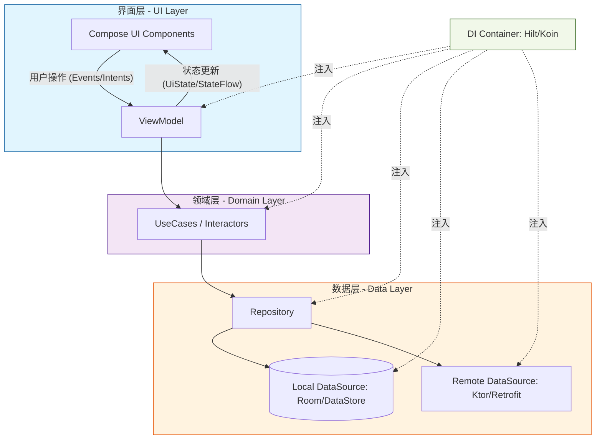

框架： 
UI： Jetpack Compose

```mermaid
graph TD
    subgraph UI_Layer [界面层 - UI Layer]
        A[Compose UI Components] -- 用户操作 (Events/Intents) --> B[ViewModel]
        B -- 状态更新 (UiState/StateFlow) --> A
    end

    subgraph Domain_Layer [领域层 - Domain Layer]
        C[UseCases / Interactors]
    end

    subgraph Data_Layer [数据层 - Data Layer]
        D[Repository]
        E[(Local DataSource: Room/DataStore)]
        F[Remote DataSource: Ktor/Retrofit]
    end

    %% 层级间调用关系
    B --> C
    C --> D
    D --> E
    D --> F

    %% 依赖注入
    G[DI Container: Hilt/Koin] -. 注入 .-> B
    G -. 注入 .-> C
    G -. 注入 .-> D
    G -. 注入 .-> E
    G -. 注入 .-> F

    %% 样式美化
    style UI_Layer fill:#e1f5fe,stroke:#01579b
    style Domain_Layer fill:#f3e5f5,stroke:#4a148c
    style Data_Layer fill:#fff3e0,stroke:#e65100
    style G fill:#f1f8e9,stroke:#33691e
```

