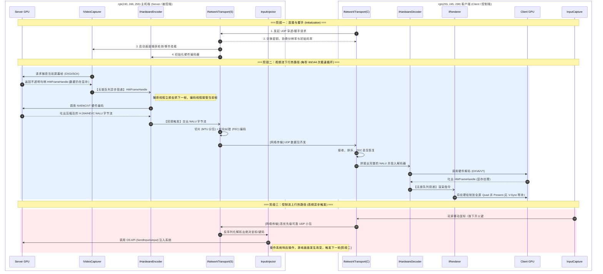

今天起的很晚11:59起床，肚子难受，不疼但是口干。

```mermaid
sequenceDiagram
    autonumber
    
    box rgb(240, 248, 255) 主机端 (Server / 被控端)
    participant GPU_S as Server GPU
    participant Cap as IVideoCapturer
    participant Enc as IHardwareEncoder
    participant Net_S as INetworkTransport(S)
    participant Inj_S as InputInjector
    end
    
    box rgb(255, 245, 238) 客户端 (Client / 控制端)
    participant Net_C as INetworkTransport(C)
    participant Dec as IHardwareDecoder
    participant Rdr as IRenderer
    participant GPU_C as Client GPU
    participant Inp_C as InputCapture
    end

    Note over GPU_S, Inp_C: === 阶段一：连接与握手 (Initialization) ===
    Net_C->>Net_S: 1. 发起 UDP 穿透/握手请求
    Net_S-->>Net_C: 2. 交换密钥、协商分辨率与初始码率
    Net_S->>Cap: 3. 启动画面捕获轮询/事件挂载
    Net_S->>Enc: 4. 初始化硬件编码器

    Note over GPU_S, Inp_C: === 阶段二：视频流下行热路径 (每秒 60/144 次极速循环) ===
    rect rgb(230, 242, 255)
    Cap->>GPU_S: 请求捕获当前屏幕帧 (DXGI/SCK)
    GPU_S-->>Cap: 返回不透明句柄 HWFrameHandle (数据仍在显存)
    Cap-)Enc: 【无锁队列异步投递】HWFrameHandle
    
    Note right of Enc: 捕获线程立即去抓下一帧，编码线程接管当前帧
    
    Enc->>GPU_S: 调用 NVENC/VT 硬件编码
    GPU_S-->>Enc: 吐出压缩后的 H.264/HEVC NALU 字节流
    Enc-)Net_S: 【回调触发】交出 NALU 字节流
    Net_S->>Net_S: 切片 (MTU 分包) + 前向纠错 (FEC) 编码
    Net_S-)Net_C: [网络传输] UDP 数据包齐发
    Net_C->>Net_C: 接收、排序、FEC 丢包恢复
    Net_C-)Dec: 拼接出完整的 NALU 并投入解码器
    Dec->>GPU_C: 调用硬件解码 (DXVA/VT)
    GPU_C-->>Dec: 吐出 HWFrameHandle (显存纹理)
    Dec-)Rdr: 【无锁队列投递】渲染指令
    Rdr->>GPU_C: 将纹理绘制到全屏 Quad 并 Present (无 V-Sync 等待)
    end

    Note over GPU_S, Inp_C: === 阶段三：控制流上行热路径 (高频异步触发) ===
    rect rgb(255, 235, 238)
    Inp_C->>Net_C: 玩家移动鼠标 / 按下开火键
    Net_C->>Net_S: [网络传输] 高优先级可靠 UDP 小包
    Net_S->>Inj_S: 反序列化解析出绝对坐标/键码
    Inj_S->>GPU_S: 调用 OS API (SendInput/uinput) 注入系统
    Note right of Inj_S: 操作系统响应操作，游戏画面发生改变，触发下一轮[阶段二]
    end
```
x